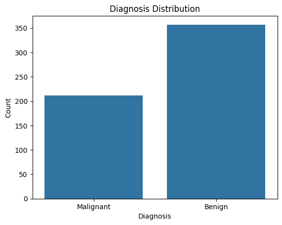
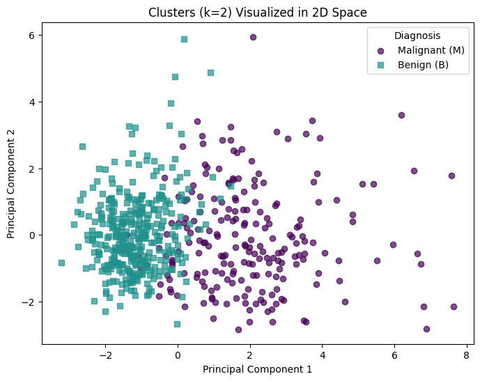
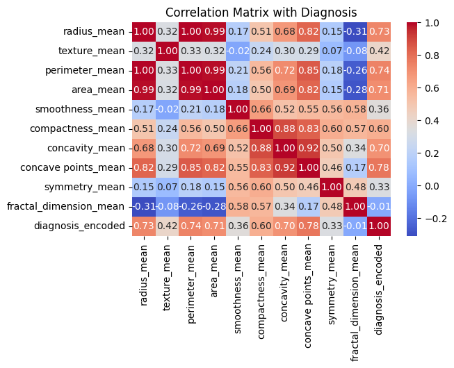
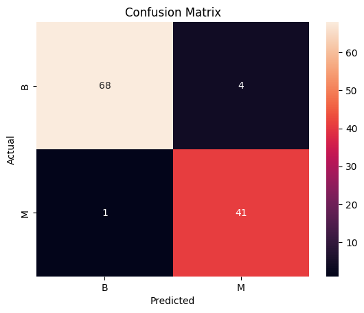
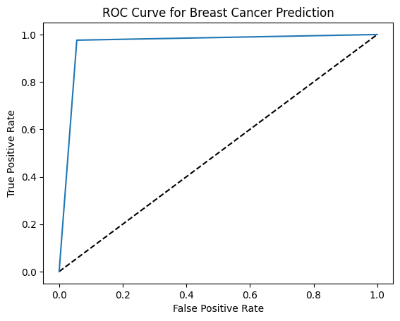

# Breast Cancer Prediction

## Project Overview

In this notebook I created a machine learning model that can predict breast cancer diagnoses, with a classification algorithm. I also performed a clustering algorithm. The motivation for this project was my own experience as a cancer patient, and my determination to help other people.

## Data Description

The dataset used in this project is sourced from the UCI Machine Learning Repository and can be accessed [here]([https://www.kaggle.com/datasets/iramshahzadi9/remote-work-and-mental-health](https://archive.ics.uci.edu/dataset/17/breast+cancer+wisconsin+diagnostic)). It contains measurements on cells in suspicious lumps in a women's breast. Ten real-valued features are computed for each cell nucleus. Features are computed from a digitized image of a fine needle aspirate of a breast mass. They describe characteristics of the cell nuclei present in the image:

- **Radius**
- **Texture**
- **Perimeter**
- **Area**
- **Smoothness**
- **Compactness**
- **Concavity**
- **Concave points**
- **Symmetry**
- **Fractal Dimension**

The mean, standard error, and "worst" or largest (mean of the three largest values) of these features were computed for each image, resulting in 30 features.

These features will be use to create our classification algorithm .
  
## Libraries Used

- **Pandas**: For data cleaning, transformation, and analysis
- **NumPy**: For numerical operations
- **Scikit-learn**: For machine learning algorithms
- **Matplotlib & Seaborn**: For data visualization

## EDA and Preprocessing

I checked for missing and duplicate values, which fortunately there were none. I also checked for outliers, but due to the nature of our data decided to keep them since they could be crucial for extraordinary cases. I created a bar plot to check if there was a class imbalance for the target variable.

Our dataset is fairly imbalanced, with more instances belonging to the benign class.

I also chose to perform binary encoding for the target variable, and scaled the measurements using the RobustScaler from Scikit-learn since this scaler tackles the biases rooting from outliers.

## Model Implementation & Evaluation

To prevent feature redundancy, I picked the mean measurement for each of the characteristics. 

**Unsupervised Learning: K-Means Clustering**

I created a k-means clustering model where k=2 to see if the features can naturally separate malignant and benign tumors into distinct groups. After that I applied PCA for visualization purposes. 

The silhouette score for this was 0.40. Not great, and it can definitely be improved, but now we move onto actual classification.

**Supervised Learning: Logistic Regression**

I decided to do some more feature engineering so I ran a correlation analysis of all the mean features with our target variable, diagnosis.

I dropped all the features that had less than a 50% correlation with diagnosis, so we end up with radius, perimeter, area, compactness, concavity, and concave points.

After training and testing the logistic regression model, I got a ROC AUC score of 99%, and an accuracy of 89%. However, the recall for malignant cases was only 81%. I adjusted the probability threshold to prioritize recall, since in medical diagnoses we want the minimum number of false negatives. 

With our adjusted threshold, our accuracy improved to 96%, and our recall for malignant cases to 98%. To visualize this, I created a heatmap of a confusion matrix for the testing set, and I also plotted the ROC Curve.

